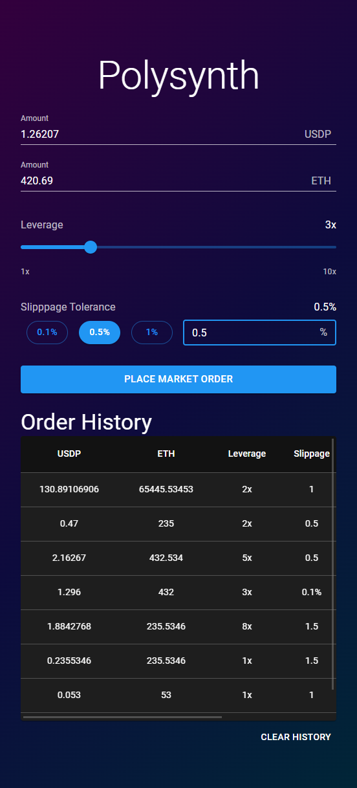

# _Polysynth_ Interview React App Task

This is a react app built as a task for an interview at [Polysynth](https://polysynth.com/)

**Framework:** React

**Version:** 18.0.0

## Live App

[Check it out here](https://polysynth-task.netlify.app)

## Installation Steps

Follow the below steps in order to run the app:

1. Clone this repo using Sourcetree or using git.

2. `yarn install` to install node packages

3. `yarn start` to run a development server

4. `yarn build` to build a production version of the React site

# Preview

## Details

- UI Library Used: [React Material UI (MUI)](https://mui.com/)

- **Home Screen**:

  1. Contains two text fields to input Amount in USDP and Amount in ETH. Only numbers are allowed to be input.
  2. Inputting USDP will auto calculate ETH amount, and similarly, inputting ETH will auto calculate USDP.
  3. Leverage can be adjusted using a slider with a range of 1 to 10. Adjusting leverage will auto calculate USDP or ETH, depending on what the user had last inputted.
  4. Slippage Tolerance can be selected using 3 radio buttons with values 0.1%, 0.5%, and 1%. Fine grain control of slipapge can be achieved by inputting the desired value in the text field next to the radio buttons. The input range is only valid from 0-5 for the text field.
  5. You can place the order once all required inputs are filled using the 'Place Market Order' button. A new order will be created using the inputs and a delay of 2sec will be added before adding the order to the order history. During the 2sec, all inputs would be disabled. Once the order placement mock is complete, a success message toast would be shown.
  6. All orders will be persisted and stored in local storage. This means any order you place will still be visible on page refresh. These orders are displayed in the table below the Order Placement Form. A 'Clear History' button is present below the table if you so wish to remove the orders from persisted local storage.
